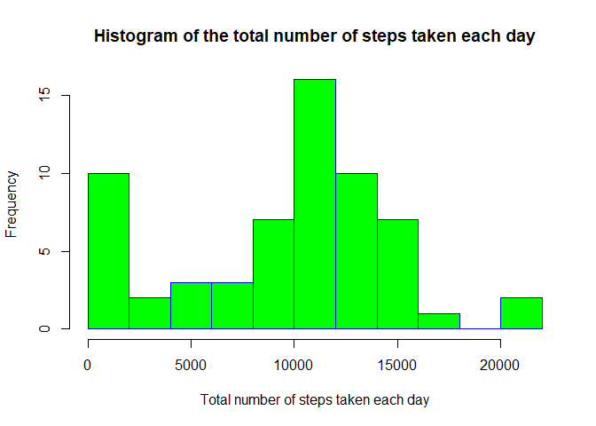
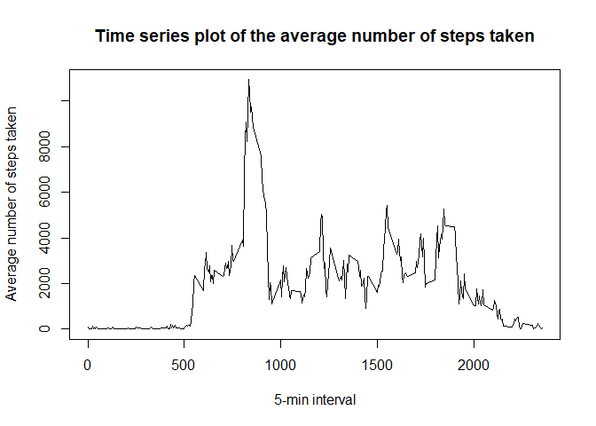
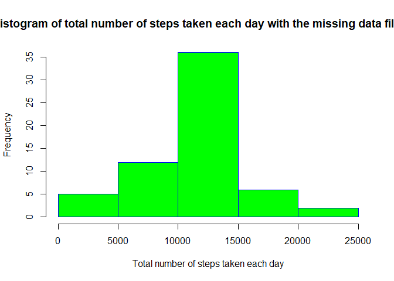
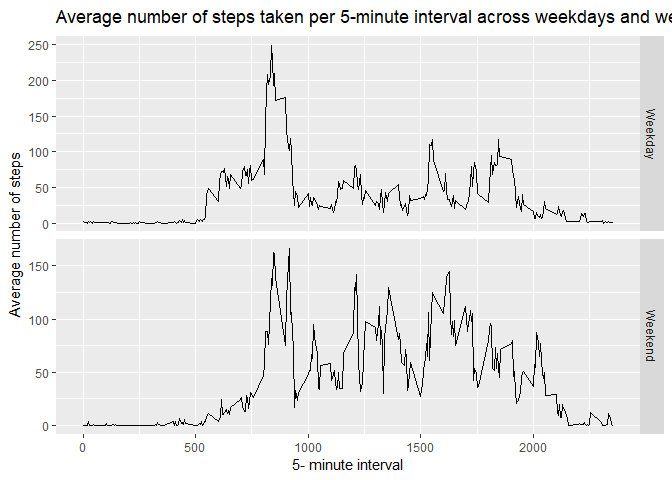

## Loading and preprocessing the data
##### 1. Load the data (i.e. read.csv())


```r
if (!file.exists("data")){
   dir.create("data")
}

URL<- "https://d396qusza40orc.cloudfront.net/repdata%2Fdata%2Factivity.zip"

download.file(URL, destfile="./data/activity.zip",  method="auto")

unzip(zipfile= "./data/activity.zip", exdir= "./data")

data<- read.csv("./data/activity.csv", header=TRUE, sep=",")
```

## What is mean total number of steps taken per day?


```r
Steps<- tapply(data$steps, data$date, sum, na.rm=TRUE)
```

##### 1. Make a histogram of the total number of steps taken each day


```r
hist(Steps, breaks=10, main="Histogram of the total number of steps taken each day", xlab="Total number of steps taken each day", 
     border="blue", col="green")
```

<!-- -->

##### 2. Calculate and report the mean and median total number of steps taken per day


```r
meanperday<- mean(Steps)
medianperday<- median(Steps)
```

*median: 9354.2295082

*mean: 9354.2295082

## What is the average daily activity pattern?

##### 1. Make a time series plot of the 5-minute interval (x-axis) and the average number of steps taken, averaged across all days (y-axis)


```r
time_series<- data.frame(tapply(data$steps, data$interval, sum, na.rm=TRUE))
colnames(time_series)<- "steps"
plot(steps ~ row.names(time_series), data=time_series, type="l", ylab = "Average number of steps taken", main = "Time series plot of the average number of steps taken", 
xlab = "5-min interval")
```

<!-- -->

##### 2. Which 5-minute interval, on average across all the days in the dataset, contains the maximum number of steps?


```r
maximum<- max(time_series)

name<- subset(time_series, steps==max(time_series))
name[1]
```

```
##     steps
## 835 10927
```

*5-minute interval that contains maximum number of steps: 10927

## Imputing missing values
### 1. Calculate and report the total number of missing values in the dataset (i.e. the total number of rows with \color{red}{\verb|NA|}NAs)


```r
total_missing_value<- sum(is.na(data$steps))
```

*Total missing value: 2304

##### 2. Devise a strategy for filling in all of the missing values in the dataset.

##### 3. Create a new dataset that is equal to the original dataset but with the missing data filled in.


```r
NewData<- data
StepsbyInterval<- data.frame(tapply(data$steps, data$interval, mean, na.rm=TRUE))
colnames(StepsbyInterval)<- "steps"

NewData$steps[which(is.na(NewData$steps))]<- StepsbyInterval$steps
```

##### 4. Make a histogram of the total number of steps taken each day 


```r
NewHist<- tapply(NewData$steps, NewData$date, sum)
hist(NewHist, breaks=5, main="Histogram of total number of steps taken each day with the missing data filled in", xlab="Total number of steps taken each day", 
     border="blue", col="green")
```

<!-- -->

#### Calculate and report the mean and median total number of steps taken per day


```r
meanSteps<- mean(NewHist)
medianSteps<- median(NewHist)
```

* The mean of total number of steps taken per day: 1.0766189\times 10^{4}  

* The median of total number of steps taken per day: 1.0766189\times 10^{4}

## Are there differences in activity patterns between weekdays and weekends?

##### 1. Create a new factor variable in the dataset with two levels – “weekday” and “weekend” indicating whether a given date is a weekday or weekend day.


```r
NewData$day <- weekdays(as.Date(NewData$date))
weekday<- subset(NewData, NewData$day=="Monday"| NewData$day=="Tusday" | NewData$day=="Wednesday" | NewData$day=="Thursday" | NewData$day=="Friday" )
weekend<- subset(NewData, NewData$day=="Saturday"| NewData$day=="Sunday")

average_weekday<- tapply(weekday$steps, weekday$interval, mean)
df1 <- data.frame(interval=names(average_weekday),mean=average_weekday)

average_weekend<- tapply(weekend$steps, weekend$interval, mean)
df2<- data.frame(interval=names(average_weekend),mean=average_weekend)

df1$day<- "Weekday"
df2$day<- "Weekend"
```

##### 2.Make a panel plot containing a time series plot (i.e. \color{red}{\verb|type = "l"|}type="l") of the 5-minute interval (x-axis) and the average number of steps taken, averaged across all weekday days or weekend days (y-axis). 


```r
df<- rbind(df1, df2)
df$interval <- as.numeric(as.character(df$interval))
ggplot(data=df, aes(x=interval, y=mean, label=round(mean, 2))) +    
geom_line()+facet_grid(day~., scales="free") +
    ylab(expression("Average number of steps")) + 
    xlab("5- minute interval") +
    ggtitle(expression("Average number of steps taken per 5-minute interval across weekdays and weekends"))+
    scale_x_continuous(breaks = round(seq(min(df$interval), max(df$interval), by = 500),1))
```

<!-- -->
